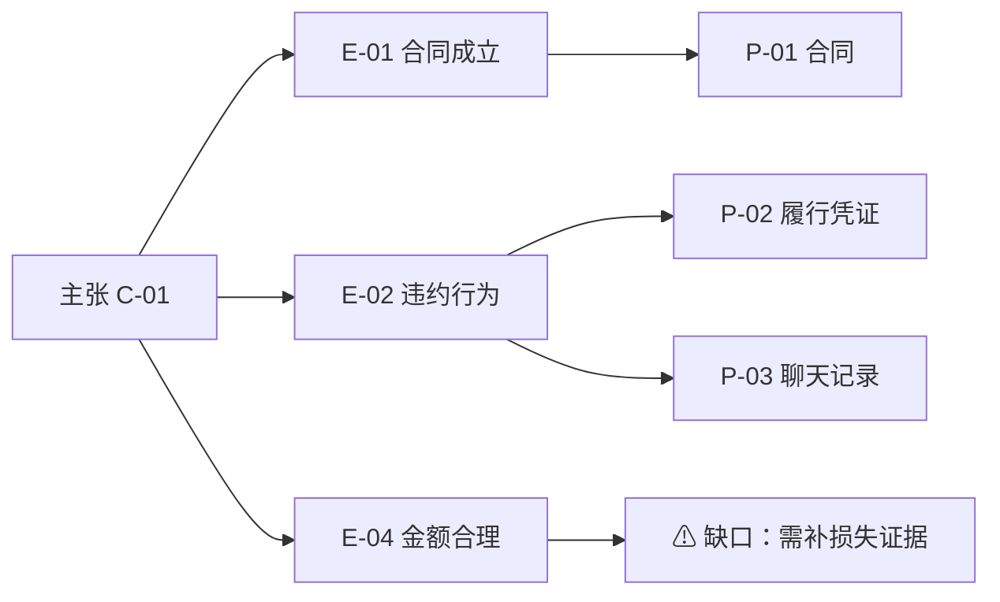

# 证据链与主张对应构建

## 一、本技能做什么

把一堆零散证据，整理成"哪项证据证明哪个主张的哪个要件、证明到什么程度"的清晰结构。
最终产出一份**证据-主张映射**，让每个法律主张都能看出证据是否够、缺在哪、如何补。

> 免责说明：本技能仅提供证据组织的方法论与分析框架，输出为辅助性梳理，不构成针对具体案件的法律意见；证据的最终采信与事实认定权属于审判机关。涉及实际诉讼时，请由具备执业资格的法律人士结合案情独立判断。

**核心链条：**

```
        最终主张（如：对方应承担赔偿责任）
              │
      ┌───────┼───────┬────────┐
    要件A    要件B    要件C    要件D
   （行为）  （后果）  （因果）  （过错）
      │        │        │        │
    证据①    证据②    证据④    证据⑥
    证据③             证据⑤   （待补充）
      │        │        │        │
   证明力强  证明力强  证明力中  证明力弱←缺口
```

**关键概念速记：**

| 概念 | 一句话理解 |
|------|-----------|
| 主张 | 希望裁判者认定的法律结论 |
| 构成要件 | 主张成立所需满足的全部法定条件，由实体法规范确定 |
| 待证事实 | 把要件落到具体、可被证据证明的事实命题 |
| 证明目的 | 某项证据拟证明的具体事实，一证可有多个目的 |
| 证明力 | 证据对待证事实的证明程度，分强/中/弱 |
| 证据链 | 多项证据相互印证、共同支撑一个要件的体系 |
| 证据缺口 | 某要件缺乏充分证据支撑的状态，需补强或调整策略 |
| 举证责任 | 谁对该事实负有提供并证明的责任，决定证据不足时谁承担不利后果 |

---

## 二、分步工作流

### 步骤 1　列主张

从诉讼请求或抗辩理由出发，逐条写出全部法律主张：
- 区分主要主张与备位主张；
- 标明每个主张的请求权/抗辩权基础（法律依据）；
- 标明该主张的举证责任方。

```
主张 C-01：对方应支付违约金 X 元
  法律依据：[填具体法条]
  类型：主要主张
  举证责任方：己方
```

### 步骤 2　拆要件

按法律规范把每个主张分解为构成要件，区分需己方证明的积极要件与需对方反证的消极要件：

```
主张 C-01 的要件分解
┌──────┬───────────────┬──────────┬─────────┐
│ 要件号│   要件内容      │ 举证责任方 │ 要件性质 │
├──────┼───────────────┼──────────┼─────────┤
│ E-01 │ 合同有效成立     │ 己方      │ 积极要件 │
│ E-02 │ 对方存在违约行为  │ 己方      │ 积极要件 │
│ E-03 │ 违约金条款有效    │ 己方      │ 积极要件 │
│ E-04 │ 违约金数额合理    │ 对方反证   │ 消极要件 │
└──────┴───────────────┴──────────┴─────────┘
```

### 步骤 3　定待证事实

把每个要件落成具体的待证事实命题，标注争议程度（高/中/低/无争议）：

```
要件 E-02（违约行为）的待证事实：
  F-02-1：对方未在约定期限前履行  [争议-高]
  F-02-2：履行质量不符合约定标准  [争议-中]
  F-02-3：擅自变更履行方式        [无争议]
```

### 步骤 4　盘证据

逐项登记全部证据，做证据三性（真实性、合法性、关联性）初评，并按证明方向初步分组（正向/不利/中性/补强）：

```
┌──────┬──────────┬────────┬──────┬──────┬───────────┐
│ 证据号│  名称     │  类型   │ 来源 │ 形式 │ 三性初评    │
├──────┼──────────┼────────┼──────┼──────┼───────────┤
│ P-01 │ 合同      │ 书证    │ 双方 │ 原件 │ 真√ 合√ 关√│
│ P-02 │ 履行凭证   │ 书证    │ 己方 │ 复印 │ 真? 合√ 关√│
│ P-03 │ 聊天记录   │ 电子数据 │ 己方 │ 截图 │ 真? 合? 关√│
└──────┴──────────┴────────┴──────┴──────┴───────────┘
```

### 步骤 5　做挂钩（核心）

把每项证据挂到它能证明的要件上，并写清证明目的。挂钩规则：
- 一证可挂多要件（一证多用）；一要件应尽量多证支撑（多证一要件）；
- 每条挂钩须标注证明方式（直接 / 间接 / 补强）与一句话证明目的；
- 按争议焦点把要件分组，同一焦点下的证据集中呈现。

证明目的写法示例：

```
P-03（聊天记录）→ E-02（违约行为）
  证明目的：对方在 [日期] 自认尚未履行，直接证明逾期事实
  证明方式：直接证明
  证明力：强（构成自认）
```

### 步骤 6　建链

单一证据不足以证明某要件时，把多项证据串成相互印证的链条：

```
要件 E-02（逾期履行）证据链：
  P-01 合同   → 确定履行期限
       ↓
  P-02 履行凭证 → 显示实际履行晚于期限
       ↓
  P-03 聊天记录 → 对方自认逾期
  逻辑：约定期限 + 实际逾期 + 对方自认 = 充分证明逾期
  完整性：★★★★★（多证印证）
```

### 步骤 7　评强弱

逐要件评估证明力，按下列五级标尺打分：

```
★★★★★ 多项直接证据相互印证，无矛盾        证明力极强
★★★★☆ 直接证据 + 补强，基本无矛盾         证明力强
★★★☆☆ 仅有直接证据无补强，或仅间接证据链   证明力中
★★☆☆☆ 单一间接证据，或证据存在瑕疵        证明力弱
★☆☆☆☆ 几乎无证据，或证据严重不足          证明力极弱
```

### 步骤 8　补缺口

对证明力不足的要件，给出可执行的补强方案并排优先级：

```
⚠ 证据缺口
  位置：E-04（违约金数额合理）
  描述：缺乏证明实际损失的直接证据
  风险：高（对方可能申请调减）
  补救：
    A 补充损失计算表及凭证
    B 申请鉴定评估损失
    C 提交同类参照数据
    D 调整诉讼策略、下调主张金额
  优先级：A > B > C > D（在举证期限届满前完成）
```

### 步骤 9　预判攻防

预测对方对每个关键主张的反驳，预置应对证据：

```
┌────────────┬──────────────┬──────────────┬───────┐
│  己方主张   │  对方可能反驳   │  应对证据/策略  │ 应对力 │
├────────────┼──────────────┼──────────────┼───────┤
│ 对方逾期    │ 主张不可抗力   │ P-03 显示系自身 │  强   │
│            │              │ 原因，非外部    │       │
│ 违约金 X 元 │ 金额过高应调减 │ 补充实际损失证据 │ 中(待补)│
└────────────┴──────────────┴──────────────┴───────┘
```

### 步骤 10　整合输出与自检

按下文"映射矩阵"汇总，再用质量清单逐项核验。论证展开顺序建议：先强后弱、先简后繁、依时间线、攻防兼顾。

---

## 三、证据-主张映射矩阵

这是本技能的核心交付物。横向为要件（按争议焦点分组），纵向为证据，交叉格标注证明关系。

```
              │ E-01   │ E-02   │ E-03   │ E-04
              │合同成立 │违约行为 │条款有效 │金额合理
──────────────┼────────┼────────┼────────┼────────
P-01 合同     │ ★直接  │ ○间接  │ ★直接  │ ○间接
P-02 履行凭证  │        │ ★直接  │        │
P-03 聊天记录  │ ○补强  │ ★直接  │        │
P-04 证人证言  │        │ ○补强  │        │
──────────────┼────────┼────────┼────────┼────────
证明力汇总     │★★★★★│★★★★★│★★★★☆│★★☆☆☆
风险提示       │  无    │复印件   │待核格式 │ ⚠薄弱
图例：★直接证明  ○间接/补强  空白=无关联
```

> 当证据多于 10 项或要件多于 6 个，矩阵会变得难读，建议改用可视化呈现：用 Mermaid 思维导图或流程图表达"主张→要件→证据"的层级与连线，并对薄弱要件用颜色或标记突出。示例骨架：



---

## 四、最终输出文档结构

```markdown
# 证据链分析

## 基本信息
案由 / 立场（原告·被告·第三人）/ 分析日期

## 一、主张体系
逐条列出主张、法律依据、举证责任、主张类型

## 二、要件分解
每个主张的要件表（要件号·内容·举证责任方·争议程度）

## 三、证据清单
证据号·名称·类型·来源·形式·三性初评

## 四、证据-主张映射矩阵
（要件多/证据多时附可视化图）

## 五、各要件证据链
待证事实 → 对应证据及证明目的 → 链条逻辑 → 证明力 → 风险

## 六、证据缺口与补强
缺口位置·描述·风险等级·补救方案·优先级

## 七、攻防预判
己方主张·对方反驳·应对·应对力

## 八、总体评估
整体充分度 / 最强环节 / 最弱环节 / 1-3 条关键建议
```

---

## 五、质量自检清单

```
完成度
  □ 全部主张已列举，且各有法律依据
  □ 各主张的要件已完整分解，举证责任分配正确
  □ 全部证据已登记并完成三性初评
  □ 映射矩阵完成，每条挂钩均有证明目的
  □ 每个要件已评证明力，缺口已识别并有补救方案

质量
  □ 无遗漏的构成要件
  □ 无错误的证据-要件挂钩
  □ 己方证据之间无时间/金额/人物矛盾
  □ 关键要件有 2 项以上证据支撑
  □ 证据链无逻辑断裂、无跳跃推理
  □ 已预判对方反驳并预置应对
  □ 无未挂钩的孤立证据（或已说明保留理由）
```

---

## 六、易错点提醒

| 易错点 | 后果 | 防范 |
|--------|------|------|
| 要件遗漏 | 主张因缺必要要件证据而不成立 | 严格对照规范逐一提取要件并交叉核对 |
| 举证责任错配 | 错位举证或漏举关键事实 | 区分积极/消极要件，核对责任分配规则 |
| 证据挂错要件 | 关键要件实际无证据却未被发现 | 逐条验证关联性，写清证明目的 |
| 忽视不利证据 | 庭审被对方反用而措手不及 | 对每份证据做正反两面分析 |
| 证据链断裂 | 达不到证明标准，难以形成心证 | 画链条图，逐环节检查衔接 |
| 孤证依赖 | 单一证据被排除则全盘崩溃 | 关键要件准备 ≥2 条独立证据路径 |
| 电子数据未固定 | 真实性被质疑，证明力削弱 | 提前公证保全或固证，保留完整上下文 |

---

## 七、典型场景适配提示

- **请求权竞合**（如违约与侵权）：为每条请求权基础各建一条独立链，比较证据覆盖率，择充分者作主主张、另作备位，并标注共用证据。
- **举证责任倒置**（如特定侵权类型）：明确哪些要件倒置，预判对方反证并准备再反驳；注意己方仍需提供初步证据。
- **多当事人/共同诉讼**：区分共用证据与个别证据，为各当事人建独立子链，标注共享关系。
- **证据难以取得**：考虑申请调查取证、书证提出命令、举证妨碍推定，或以间接证据链替代直接证据。
