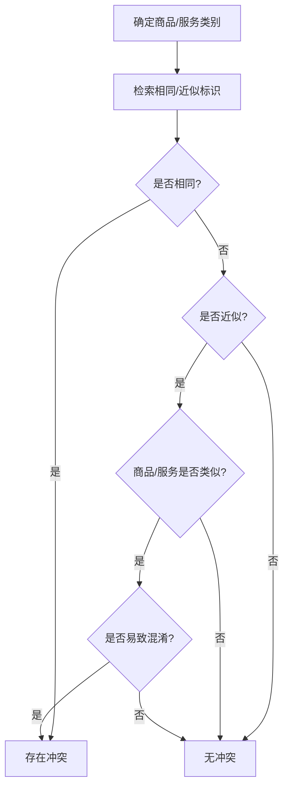

# 商标侵权判断与风险分析

本技能提供系统化的商标侵权判断方法，用于判定涉案行为是否落入注册商标专用权范围、评估侵权风险等级，并产出结构化分析意见。核心是"五步递进判断法"，辅以相同/近似认定要素、混淆可能性考量、抗辩与例外规则。

**适用场景**：涉案标识是否侵权的判定、客户侵权风险咨询答复、相同/近似性比对、混淆可能性评估、商标注册前的冲突检索判断、侵权分析意见撰写。

**重要提示（务必遵守）**：
- 本技能涉及的判断标准、审查审理规则、法律条文及其条款号与版本（如商标法的修正年份、相关判断标准与审查指南的发布文号与版本、商品和服务分类表的版本）均须在引用前自行核实最新有效文本，不得凭记忆臆断或捏造条文编号、内容、案例与裁判结果。
- 区分表、判断标准、审查指南均会更新，类似性与近似性判断须以现行有效版本为准。
- 本技能输出为分析参考，不构成正式法律意见；涉及实际维权或应诉决策的，应由具备相应资质的执业人员复核并结合个案证据出具正式意见。

---

## 一、五步递进判断法

对每一个侵权判断请求，按以下五步顺序分析，前一步不成立则通常无需进入后续步骤（销售侵权商品、伪造或擅自制造商标标识等特定情形可径行进入侵权认定，见第六部分）。

### 第一步：是否构成"商标性使用"

判断涉案行为是否属于用以识别商品或服务来源的使用，而非单纯的描述、说明或权利声明。

**通常构成商标性使用的情形**：
- 将标识贴附、印刷、烙印、编织于商品本身、包装、容器、标签、说明书、价目表等载体；
- 用于销售合同、发票、票据、报关或检验检疫单据等交易文书；
- 用于服务场所招牌、店堂装潢、人员服饰、菜单、宣传手册等；
- 用于广播、电视、网络、出版物、广告牌、户外或邮寄广告等宣传活动；
- 用于展览、展销、博览等商业场合。

**通常不构成商标性使用的情形**：
- 仅公布注册信息或声明对注册商标享有专用权；
- 未进入公开商业领域的内部使用；
- 仅作赠品且未单独标注该标识；
- 仅有转让或许可行为而无实际使用；
- 仅为维持注册的象征性、敷衍性使用。

**综合考量**：使用人主观意图、标识的可见性与显著位置、宣传方式的稳定性、行业惯例、相关公众的实际认知。

### 第二步：是否未经权利人许可

确认涉案使用是否落入"未经许可"或"超出许可范围"：
- 完全未获许可；
- 虽有许可，但超出许可的商品/服务类别、地域、期限、数量、门店数等约定范围。

**核查要点**：许可合同、备案信息、核定商品类别、许可期限与范围限制条款。无许可的无需举证；主张超范围的，由主张方就范围限制及越界事实举证。

### 第三步：商品/服务是否相同或类似

**比对基准**：以注册商标**核定使用**的商品/服务（而非权利人实际经营的商品/服务）与被诉商品/服务进行比对。

**判断路径**：
1. 先查现行商品和服务分类表中的类似群组，落入同一群组的一般推定类似；
2. 分类表未涵盖或存在争议的，综合判断——
   - 商品：功能、用途、主要原料、生产部门、消费对象、销售渠道；
   - 服务：目的、内容、方式、提供主体、对象、场所。
3. 以相关公众的一般认知为准，而非专业人士的细分认知。

**示例（仅示意判断思路，不替代个案分析）**：功能、用途、消费对象高度重合的两类商品，倾向认定类似；属容器与所盛装内容物这类用途完全不同者，倾向不类似。

### 第四步：商标是否相同或近似

**比对基准**：以**核准注册**的商标样式（而非权利人实际使用的变体）与被诉标识比对。

**总体规则**：组合标识中文字部分通常为主要识别要素，识别权重大体为 文字 > 图形 > 颜色；个案中应以实际识别效果为准。

#### 相同的认定
视觉或听觉效果基本无差别、相关公众难以区分。常见情形：仅字体或大小写不同、横竖排列或字间距变化、增加不影响识别的通用名称或修饰成分、图形细微差别不影响整体视觉效果。

#### 近似的认定（三种观察方法结合）
- **隔离观察**：以对一方标识的记忆印象判断，模拟相关公众实际选购场景，而非两标识并列对照；
- **整体比对**：着眼整体构成与外观给人的总体印象；
- **主要部分比对**：提取发挥主要识别作用的显著部分进行比较。

判断标准：以**相关公众的一般注意力**为尺度。

**近似的常见维度**：
- 文字：字形相近、读音相近、含义相近、字序颠倒而整体含义无明显区别；
- 图形：构图要素、设计风格、表现手法相近，整体视觉易致混淆；
- 组合：文字部分近似、显著识别部分近似、整体排列组合近似。

**不近似的常见情形**：核心文字含义差异明显、呼叫与含义均无关联、添加成分使整体识别效果发生实质区别。

### 第五步：是否容易导致混淆（仅在近似标识或类似商品/服务情形下适用）

相同标识用于相同商品时，通常直接推定，无需单独论证混淆。其余情形需评估混淆可能性。

**混淆类型**：
- 来源混淆：相关公众误认被诉商品/服务来自权利人；
- 关联混淆：相关公众误认双方存在投资、许可、加盟、合作等特定联系。

**混淆可能性考量要素清单**（各要素相互作用，无单一决定因素，大体按影响力排序）：

| 要素 | 具体内容 |
|------|----------|
| 标识近似程度 | 越近似，混淆可能性越高 |
| 注册商标显著性 | 固有显著性或经使用获得的显著性越强，保护越强 |
| 注册商标知名度 | 知名度越高，保护范围越宽，对类似与近似的容忍度越低 |
| 商品/服务类似程度与关联性 | 越类似、关联越强，越易混淆 |
| 市场因素 | 销售渠道、销售场所、消费群体、价格区间的重叠程度 |
| 主观因素 | 是否有攀附故意、是否存在实际混淆证据 |
| 其他因素 | 共存历史、相关公众的注意程度与专业性 |

**要点**：混淆不以实际发生为要件，存在混淆可能性即可；知名度高的标识可获得相对更宽的保护范围。

---

## 二、相同/近似比对要素（内联速查）

| 标识类型 | 相同判断侧重 | 近似判断侧重 |
|----------|--------------|--------------|
| 文字 | 字体/大小写/排列/字间距变化不影响识别 | 字形、读音、含义、字序 |
| 图形 | 构图要素与表现形式视觉基本无差别 | 构图要素、设计风格、表现手法、整体视觉 |
| 组合 | 文字+图形+排列组合整体无差别 | 文字部分、显著识别部分、整体排列组合 |

**比对纪律**：始终以核准注册样式对被诉标识，以隔离观察为基础，以相关公众一般注意力为尺度，避免以专业人士的细致对比代替普通消费者的整体印象。

---

## 三、混淆可能性与知名度

- 知名度高的注册商标：保护的商品/服务范围更宽，近似与类似的认定门槛相对宽松；
- 显著性弱或知名度低的标识：需要更强的近似性与类似性证据方可认定混淆；
- 攀附故意可作为混淆可能性的加强因素，但非必要条件；
- 实际混淆证据（如消费者误认记录、客服咨询、评价误指等）具有较强证明力，但其缺失不排除混淆可能性。

---

## 四、抗辩与例外规则（内联清单）

### 描述性正当使用
同时满足方可成立：使用的是商品/服务的通用名称、图形、型号或直接表示品质、功能、用途等特点的描述性成分；使用方式是说明商品特点而非识别来源；客观上不致引起相关公众混淆。将描述性词汇作为标识突出、单独使用的，不成立此抗辩。

### 指示性正当使用
为说明商品适配、兼容或服务对象而善意提及他人标识（如配件适配说明、维修对象指明）：须限于必要范围、不得突出他人标识、不得暗示或夸大与权利人存在授权或关联关系（如"官方""正品授权"等表述）。

### 合法来源（不知情销售）抗辩
同时满足方可减免赔偿：能证明商品有合法来源（进货凭证、合同等）；确实不知道所销售商品侵权（非主观故意）。成立的，可免除赔偿责任但仍须停止销售。进货渠道异常且价格明显偏低、拒不提供进货凭证、转移或销毁证据、同类情形受处后再犯等，通常不认定"不知情"。

### 在先使用抗辩
在注册商标申请日之前已在相同或类似商品上先于注册人使用并有一定影响的标识，可在原使用范围内继续使用，但权利人有权要求附加适当区别标识。

### 注册商标连续未使用的抗辩与撤销风险
注册商标无正当理由连续一定期限未实际使用的，相关方可据此抗辩或申请撤销。正当理由通常包括不可抗力、政策性限制、破产清算等不可归责于注册人的事由；许可他人使用并有被许可人使用证据的，可视为使用。

### 程序性中止
被诉所依据的注册商标处于无效宣告审理、权属争议、续展宽展期等不确定状态的，可视情中止侵权认定，等待确权结果。

---

## 五、注册检索冲突判断

用于注册前或维权前评估冲突风险。

**检索范围**：相同商品/服务上的相同与近似标识；类似商品/服务上的相同与近似标识；以及可能构成障碍的在先权利（在先商标权、著作权、企业名称权/字号、外观设计专利权、姓名权/肖像权、域名等）。

**检索策略**：
- 文字标识：完全相同、读音近似、字形近似、含义近似、字序颠倒等多路检索；
- 图形标识：要素分解、整体外观、构图方式检索；
- 组合标识：文字部分单独检索、图形部分单独检索、整体检索并行。

**冲突判断流程**：



检索结论应载明：检索对象、检索范围与关键词、相同与近似标识数量、逐一比对分析、冲突结论与风险等级、规避建议。

---

## 六、特殊情形快速判断

- **字号突出使用**：将与他人注册商标相同或近似的字号在商品/服务上突出使用（字体、大小、颜色显著区别于其余文字），结合商品类似性与混淆可能性判断是否构成侵权；字号完整、规范、非突出标注的，一般不构成。
- **自行改变或组合注册商标后使用**：以改变或组合后的实际标识为比对基准，落入他人专用权范围且致混淆的构成侵权。
- **不指定颜色商标的颜色附着**：以攀附为目的为标识附着颜色，与他人标识近似并致混淆的构成侵权；攀附意图可结合权利人知名度、行业关联、有无正当理由综合判断。
- **平台/市场主办方责任**：明知或应知经营者侵权而不制止，或经有效通知后未采取必要措施的，可构成帮助侵权。
- **域名情形**：注册、使用与他人注册商标相同或近似的域名并借此从事相关商业活动、易致误认，且无正当权益、具有恶意的，可构成侵权。
- **驰名标识的扩大保护**：经认定为驰名的，可在一定条件下获得跨类保护，禁止他人复制、摹仿或翻译并致混淆或淡化的使用；认定须个案审查，不得当然套用。

---

## 七、常见误区

- 以权利人**实际使用**的商品/标识替代**核定/核准**的商品/标识作为比对基准——应以核定商品与核准样式为准；
- 以"必须发生实际混淆"为侵权前提——存在混淆可能性即可；
- 将"合法来源"等同于"完全免责"——其仅可能减免赔偿，停止侵权义务不免；
- 以旧版分类表、旧版判断标准或审查指南进行判断——须用现行有效版本；
- 以并列对照代替隔离观察、以专业人士视角代替相关公众一般注意力。

---

## 八、输出格式

### 详细分析意见

```
【商标侵权分析意见】

一、基本情况
   - 权利人/注册商标：注册号、核定类别、核准样式、专用权状态
   - 被诉方与被诉行为：使用场景、载体、商品/服务
   - 比对基准：核定商品 vs 被诉商品；核准样式 vs 被诉标识

二、五步要件逐项分析
   1. 商标性使用：□构成 □不构成（理由）
   2. 许可情况：□无许可 □超范围（类别/地域/期限/数量）
   3. 商品/服务类似性：□相同 □类似 □不类似（依据）
   4. 标识相同/近似：□相同 □近似（隔离观察/整体比对/主要部分比对）□不近似
   5. 混淆可能性（适用时）：近似程度/显著性/知名度/类似程度/市场因素/主观因素 → □易混淆 □不易混淆

三、抗辩与例外评估
   - 可能成立的抗辩：描述性/指示性正当使用、合法来源、在先使用、连续未使用、程序中止等
   - 评估结论及其对侵权认定或责任承担的影响

四、综合结论
   - 是否构成侵权：□是 □否 □需补强证据
   - 侵权情形归类与对应依据（须核实现行条文）
   - 风险等级：□高 □中 □低

五、建议
   - 维权方向：函告、行政投诉、民事诉讼、证据保全等
   - 证据固定：实物、网页、销售数据、宣传材料等
   - 整改方向（被诉方视角）：停用、变更字号、调整范围等

六、参考依据
   - 引用的法律、判断标准、审查指南条文（引用前须核实文号、版本与条款）
   - 同类裁判要点（须核实真实存在，不得杜撰）
```

### 快速风险评估

```
【商标侵权风险快评】
一、结论：风险等级 □高 □中 □低；是否侵权 □是 □否 □不确定
二、要件速判：使用性 / 类似性 / 近似性 / 混淆可能性
三、提示：主要风险点、可用抗辩、证据准备建议
```

---

## 九、工作流程

1. **识别请求类型**：个案侵权判定用详细分析意见；快速咨询用快速风险评估；注册前评估用冲突判断流程。
2. **收集基本信息**：注册商标信息（注册号、核定类别、有效期、核准样式）、被诉行为（使用场景、商品/服务、载体）、相关证据。
3. **执行五步法**：按第一部分顺序逐步判断，必要时回到第二、四部分速查要素，引用的每一处条文与标准均先核实现行文本再写入。
4. **评估抗辩与例外**：对照第四部分清单逐项检视。
5. **产出结论**：选择对应输出格式，给出风险等级与建议，并附"本分析为参考意见、非正式法律意见，须执业人员结合个案证据复核"的提示。
6. **后续跟进**：证据不足的提示补强；涉及重大决策的建议由执业人员出具正式意见。
